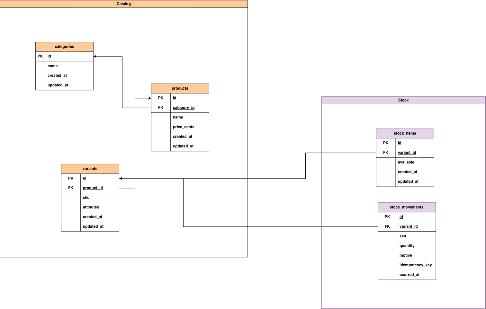
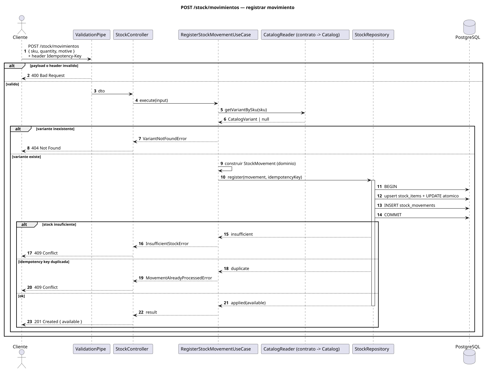
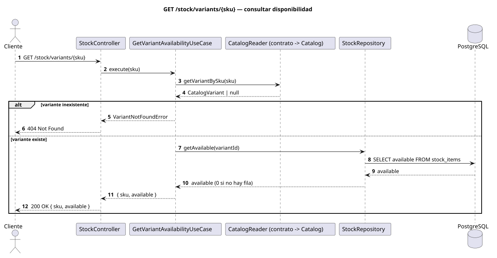

# ecommerce-challenge

Backend de catálogo y stock para el challenge de Bidcom. La idea: manejar
productos (con categorías y variantes) y el stock de cada variante, dejando
registrado cada movimiento.

## Stack

- Node 24 (LTS) + TypeScript estricto (ESM)
- NestJS 12 + TypeORM 1 + PostgreSQL 17 (Docker)
- Jest para tests (unit + e2e)
- ESLint + Prettier, Husky + commitlint
- Swagger (OpenAPI) y logs estructurados (pino + CLS) con correlation id (`x-request-id`)

## Cómo correrlo

**Opción 1 — local (dev, con hot reload):**

```bash
npm install
cp .env.example .env

docker compose up -d      # Postgres + Adminer
npm run db:setup          # corre migraciones y carga datos de ejemplo
npm run start:dev
```

**Opción 2 — todo en Docker (un solo comando):**

```bash
docker compose --profile app up --build
# levanta Postgres + Adminer + la app (corre migraciones y seed solos)
```

La app queda en `http://localhost:3000`:

- Swagger: `http://localhost:3000/docs`
- Adminer: `http://localhost:8080` (Server: `postgres`; user/pass/db salen del `.env`)

## Módulos

Lo separé en 2 contextos, cada uno hexagonal (`domain` / `application` / `infrastructure`):

- **Catalog**: categorías, productos y variantes. Expone un contrato (`CatalogReader`)
  para que otros contextos consulten variantes por SKU.
- **Stock**: el stock de cada variante. Guarda el saldo (`stock_items`) y el historial
  de cambios (`stock_movements`).

Stock usa a Catalog a través de ese contrato: hoy es una llamada in-process; si
mañana Stock se separa en un servicio, se cambia el adaptador por uno HTTP y listo.

## Endpoints

| Método | Ruta                   | Qué hace                    |
| ------ | ---------------------- | --------------------------- |
| POST   | `/stock/movimientos`   | Registra un movimiento      |
| GET    | `/stock/variants/:sku` | Disponible de una variante  |
| GET    | `/health/live`         | Liveness                    |
| GET    | `/health/ready`        | Readiness (chequea la base) |
| GET    | `/docs`                | Swagger                     |

**`POST /stock/movimientos`**

```
body:   { "sku": "RUN-42-BLACK", "quantity": 5, "motive": "PURCHASE" }
header: Idempotency-Key (opcional; si lo envías, es idempotente)
```

Respuestas: `201` ok · `400` body inválido · `404` SKU inexistente ·
`409` sin stock suficiente o key repetida. Todas las respuestas de error
incluyen `requestId`.

Motivos: `PURCHASE`, `RETURN`, `ADJUSTMENT_IN` suman; `SALE`, `LOSS`,
`ADJUSTMENT_OUT` restan. La cantidad siempre es positiva y el motivo define la
dirección.

## Probarlo

- **Swagger**: abre `/docs` y prueba desde ahí.
- **REST Client**: `docs/http/stock.http` (y `health.http`).
- **curl**:

```bash
curl -X POST http://localhost:3000/stock/movimientos \
  -H 'Content-Type: application/json' -H 'Idempotency-Key: demo-1' \
  -d '{"sku":"RUN-42-BLACK","quantity":2,"motive":"SALE"}'
```

Si envías la misma `Idempotency-Key` dos veces, la segunda responde `409`. Sin
header, cada request se registra (no deduplica).

SKUs de ejemplo: `RUN-42-BLACK`, `RUN-43-BLACK`, `RUN-42-WHITE`,
`TRAIL-42-BLACK`, `HOODIE-M-BLACK`, `HOODIE-L-BLACK`.

## Diagramas

Flujo del módulo Stock:


Modelo de datos (contextos `Catalog` y `Stock`):



Secuencia — `POST /stock/movimientos`:



Secuencia — `GET /stock/variants/:sku`:



> Las secuencias están hechas en PlantUML (`docs/stock/*.puml`). Para regenerar los
> SVG: `npm run diagrams:render`.

## Decisiones

- La cantidad es positiva y el **motivo** define si suma o resta.
- Una salida sin stock suficiente devuelve **409** y no se registra.
- La registración es **idempotente** (`Idempotency-Key`): repetir no duplica.
- El saldo se actualiza en una **transacción** con `UPDATE` condicional, así que
  dos salidas simultáneas no sobrevenden.
- El saldo vive en `stock_items` y el historial en `stock_movements`.
- Dejé **todo en `main` a propósito**: así la historia se lee lineal y se sigue el
  paso a paso. En un equipo, lo ideal es trabajar con **feature branches** + PRs.

## Observabilidad

- **Correlation id end-to-end**: se respeta `x-request-id` si viene (si no, se
  genera un UUID) y se devuelve en la respuesta. Viaja en el contexto del request
  (`nestjs-cls`/AsyncLocalStorage) y aparece como `requestId` en toda línea de
  log, además del body de los errores.
- **Logs estructurados** (pino): JSON en prod y pretty en dev. Cada línea lleva
  metadata fija (`service`, `env`, `version`, `pid`, `hostname`) para filtrar por
  servicio/entorno/versión. El nivel por status: 5xx `error`, 4xx `warn`, resto `info`.
- **Sin ruido de probes**: `/health*` y `/docs*` no generan línea de access log
  (los healthchecks de Docker/k8s pegan seguido).
- **Errores**: `DomainExceptionFilter` mapea el dominio a HTTP; un
  `AllExceptionsFilter` (catch-all) cubre validación, rutas y errores inesperados.
  Todos devuelven `{ statusCode, error, message, requestId }`. Los 5xx se loguean
  con stack sólo server-side y responden un mensaje genérico (no filtran internals).
- **Graceful shutdown**: en `SIGTERM`/`SIGINT` se cierran las conexiones de la
  base (`enableShutdownHooks`).

## Tests

```bash
npm test          # unit
npm run test:e2e  # e2e (requiere Postgres levantado)
```

## Scripts

| Comando                      | Descripción                       |
| ---------------------------- | --------------------------------- |
| `npm run start:dev`          | Dev server con watch              |
| `npm run build`              | Compila                           |
| `npm run lint`               | ESLint                            |
| `npm run typecheck`          | Chequeo de tipos                  |
| `npm test`                   | Tests unitarios                   |
| `npm run test:e2e`           | Tests end-to-end                  |
| `npm run db:setup`           | Migraciones + seed                |
| `npm run seed`               | Carga datos de ejemplo            |
| `npm run migration:run`      | Aplica migraciones                |
| `npm run migration:generate` | Genera una migración              |
| `npm run diagrams:render`    | Regenera los SVG de los diagramas |

## Futuras mejoras

Cosas que dejaría para una próxima iteración:

**Seguridad**

- Auth con JWT (guard global + `@Public`) y roles. Encaja con el dominio: un
  ajuste manual (`ADJUSTMENT_*`) pediría rol admin; `SALE` lo hace el sistema.
- Rate limiting en los endpoints de lectura (`@nestjs/throttler`).

**Evolución**

- Extraer Stock a un servicio propio: como se habla con Catalog por contrato
  (no por tabla), se cambia el adaptador in-process por uno HTTP y listo.
- Eventos: consumir `OrderPlaced`/`OrderCancelled` para registrar la salida sola,
  y emitir `StockLow`/`StockDepleted` (patrón transactional outbox, consumo idempotente).
- Exponer también GraphQL: los casos de uso son agnósticos del transporte, se
  agregan resolvers reutilizándolos.

**Observabilidad**

- Métricas (Prometheus) y tracing (OpenTelemetry), apoyadas en el correlation id actual.

**Dominio**

- Reservas de stock para el carrito (con vencimiento).
- Stock por depósito/ubicación (hoy es una fila por variante).

**Rendimiento y calidad**

- Tests de carga con **k6** (varios escenarios: muchos `SALE` concurrentes sobre
  el mismo SKU, picos de lectura de disponibilidad, etc.).
- **Índices** en la BD según las consultas reales. Hoy hay `UNIQUE` en `sku`,
  `variant_id` e `idempotency_key`, más índices en las FK (`products.category_id`,
  `variants.product_id`). Quedaría sumar GIN sobre `variants.attributes` y un
  compuesto `(variant_id, occurred_at)` en `stock_movements` cuando exista la query
  de historial.
- **Cache** (ej. Redis) para lecturas de disponibilidad/catálogo, si el tráfico lo pide.

**Infra / entrega**

- CI (lint + typecheck + tests) y contract testing del OpenAPI.

---

<sub>Fin de la solución. Lo que sigue es el enunciado original del challenge.</sub>

---

## Enunciado original

> Texto original del challenge, incluido acá tal cual como contexto.

### Contexto

Una plataforma de ecommerce necesita gestionar su catálogo de productos y el stock disponible. Tu tarea es implementar una parte del backend usando NestJS.

### El dominio

La plataforma vende productos organizados en categorías. Un producto tiene un nombre, una descripción, un precio y pertenece a una categoría. Un producto puede tener variantes; por ejemplo, un mismo modelo de zapatilla existe en distintos talles y colores. Cada variante es la unidad que tiene stock propio y es la que el cliente agrega al carrito.

Cuando el stock de una variante cambia, el cambio tiene que quedar registrado: cuándo ocurrió, cuántas unidades se movieron y por qué motivo (por ejemplo una compra, una devolución o un ajuste manual). El sistema siempre tiene que poder responder cuánto stock hay disponible.

Cuando un cliente intenta agregar una variante al carrito, el sistema verifica si hay stock disponible. Si no hay, no puede agregarse.

### Lo que tenés que implementar

#### `POST /stock/movimientos`

El body llega con el SKU de la variante, la cantidad y el motivo. El sistema registra el movimiento y deja el stock disponible de esa variante en un estado correcto.

Definí vos cómo modelar cantidades, qué motivos aceptás y qué pasa cuando no hay stock suficiente para una salida.

### Stack esperado

- NestJS con TypeScript estricto
- TypeORM o Prisma
- PostgreSQL o SQLite

Se espera que el código tenga responsabilidades claras y bien separadas. Cómo lo estructurás queda a tu criterio.

### Entrega

Repositorio en GitHub con un historial de commits claro y legible — que se entienda cómo fuiste construyendo la solución — y documentación que refleje cómo pensaste el problema, cómo está organizado el sistema, las decisiones de diseño que tomaste y, si aplica, cómo correr o probar tu solución más allá de lo que ya describe este README.

El formato, ubicación y nivel de detalle quedan a tu criterio. Forma parte de la evaluación.
