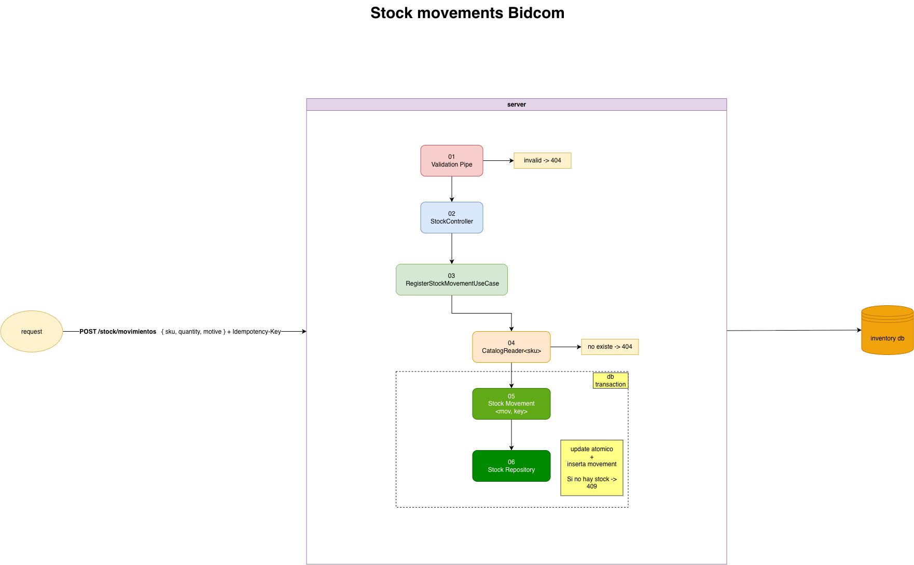
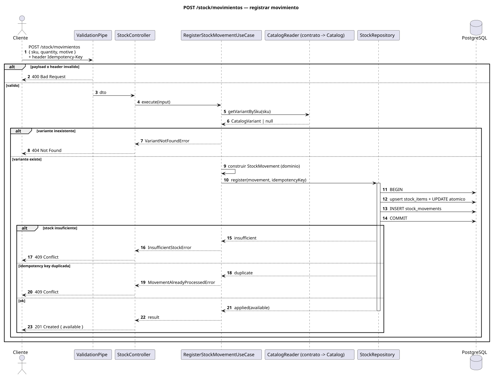
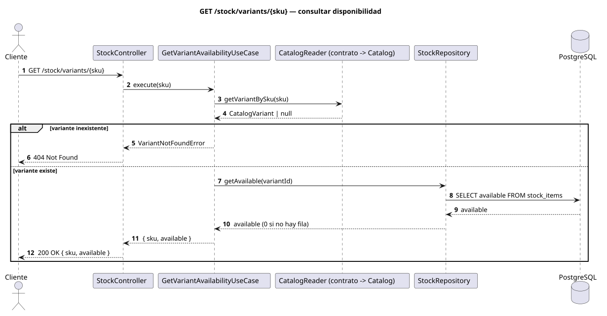

# ecommerce-challenge

---

## Enunciado

### Contexto

Una plataforma de ecommerce necesita gestionar su catálogo de productos y el stock disponible. Tu tarea es implementar una parte del backend usando NestJS.

### El dominio

La plataforma vende productos organizados en categorías. Un producto tiene un nombre, una descripción, un precio y pertenece a una categoría. Un producto puede tener variantes; por ejemplo, un mismo modelo de zapatilla existe en distintos talles y colores. Cada variante es la unidad que tiene stock propio y es la que el cliente agrega al carrito.

Cuando el stock de una variante cambia, el cambio tiene que quedar registrado: cuándo ocurrió, cuántas unidades se movieron y por qué motivo (por ejemplo una compra, una devolución o un ajuste manual). El sistema siempre tiene que poder responder cuánto stock hay disponible.

Cuando un cliente intenta agregar una variante al carrito, el sistema verifica si hay stock disponible. Si no hay, no puede agregarse.

### Lo que tenés que implementar

#### `POST /stock/movimientos`

El body llega con el SKU de la variante, la cantidad y el motivo. El sistema registra el movimiento y deja el stock disponible de esa variante en un estado correcto.

Definí vos cómo modelar cantidades, qué motivos aceptás y qué pasa cuando no hay stock suficiente para una salida.

### Stack esperado

- NestJS con TypeScript estricto
- TypeORM o Prisma
- PostgreSQL o SQLite

Se espera que el código tenga responsabilidades claras y bien separadas. Cómo lo estructurás queda a tu criterio.

### Entrega

Repositorio en GitHub con un historial de commits claro y legible — que se entienda cómo fuiste construyendo la solución — y documentación que refleje cómo pensaste el problema, cómo está organizado el sistema, las decisiones de diseño que tomaste y, si aplica, cómo correr o probar tu solución más allá de lo que ya describe este README.

El formato, ubicación y nivel de detalle quedan a tu criterio. Forma parte de la evaluación.

---

## About this repository

This repo is the starting point for the challenge. It uses NestJS 12, TypeORM 1, and PostgreSQL 17 (via Docker).

TypeScript is configured in strict mode with sensible additional rules (`noUncheckedIndexedAccess`, explicit return types, no `any`, no floating promises, etc.). Run `npm run typecheck` and `npm run lint` before submitting.

## Diagrams

Stock module flow:



Data model (bounded contexts `Catalog` and `Stock`):


Sequence — `POST /stock/movimientos`:



Sequence — `GET /stock/variants/:sku`:



## Project structure

Two empty NestJS modules are included: `catalog` and `stock`. Use them, rename them, or reorganize — whatever fits your design.

## Requirements

- Node.js 24 LTS (`>=24`)
- npm >= 10

Use the version in `.nvmrc` if you rely on nvm:

```bash
nvm use
```

## Installation

```bash
npm install
cp .env.example .env
```

## Running the project

Start PostgreSQL first (see the next section), then:

```bash
npm run start:dev
```

The app runs at `http://localhost:3000`. Verify it started with:

```bash
curl http://localhost:3000/health
```

## PostgreSQL with Docker

```bash
docker compose up -d
```

The connection is already configured in `.env` (copied from `.env.example`):

```env
DB_HOST=localhost
DB_PORT=5432
DB_USERNAME=postgres
DB_PASSWORD=postgres
DB_DATABASE=ecommerce_challenge
```

## Migrations

Schema is managed by migrations (set `DB_SYNCHRONIZE=false`, the default). To create or apply:

```bash
npm run migration:generate -- src/shared/infrastructure/database/migrations/MigrationName
npm run migration:run
```

## Scripts

| Command              | Description           |
| -------------------- | --------------------- |
| `npm run start:dev`  | Dev server with watch |
| `npm run build`      | Compile               |
| `npm run lint`       | ESLint                |
| `npm run typecheck`  | Type checking         |
